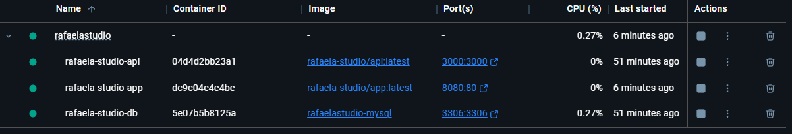

# Rafaela Studio
Projeto de PI da Faculdade de Gestão de Tecnologia - Fatec Campinas

## Rodando a aplicação

Tenha o [Docker Desktop](https://www.docker.com/) instalado

No terminal, navegue até a pasta raiz deste projeto e execute o comando abaixo (windows ou linux):

```bash
docker-compose up -d
```

Agora é só aguardar que todas as aplicações estarão disponíveis e integradas:



- MySQL Server
  - Container: rafaela-studio-db
  - Porta: 3306
- FrontEnd APP
  -  Container: rafaela-studio-api
  -  Porta: 3000
- BackEnd API
  -  Container: rafaela-studio-app
  -  Porta: 8080
  

## Testando no Postman

Basta utilizar a coleção de chamadas para a API disponível neste [arquivo](./docs/RafaelaStudio_API.postman_collection.json)
Para isso, salve o arquivo e importe no Postman

[Download do Postman](https://www.postman.com/)